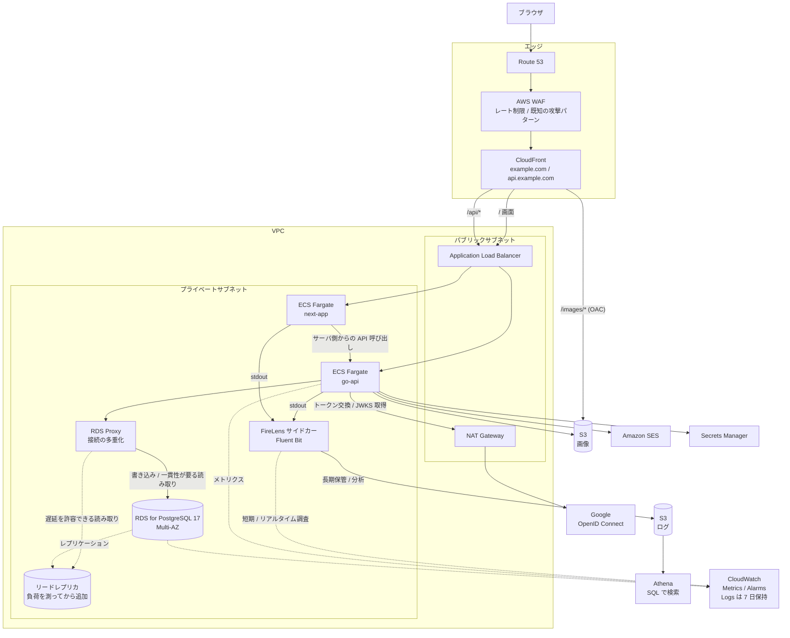

# インフラ構成 (理想構成)

- 日付: 2026-08-05
- ステータス: **設計ドキュメント。実際にはデプロイしない**

## この文書の位置づけ

**デプロイの計画ではなく、実装の指針として先に描いたもの。**

実際に動かすのはローカルの `compose.yaml` だけであり、
AWS 上に構築する予定はない。それでもこの図を先に描くのは、
「本番に出すならどこに置くか」を決めておかないと、
実装中の細かい判断 (画像をどこに置くか、秘密情報をどう読むか、
どのプロセスが外向き通信をするか) が場当たりになるため。

実装が進んで実態がズレたら、この文書を更新する。

## 全体構成



**点線のリードレプリカは、まだ置かない。**
負荷を測ってから追加する ([ADR 0009](adr/0009-scaling-strategy.md))。
ただしアプリ側は最初から読み書きの経路を分けて書く。

## ローカル (compose) との対応

| `compose.yaml` | 理想構成 | 備考 |
| --- | --- | --- |
| `postgres` (postgres:17-alpine) | RDS for PostgreSQL 17 Multi-AZ | バージョンを揃える |
| `migrate` (migrate/migrate) | ECS の単発タスクとして実行 | アプリ起動時に走らせない (下記) |
| `go-api` | ECS Fargate サービス | |
| `next-app` | ECS Fargate サービス | |
| **MinIO** (追加予定) | S3 (画像 / ログ) | [ADR 0007](adr/0007-image-storage.md) |
| **Mailpit** (追加予定) | Amazon SES | [ADR 0008](adr/0008-contact-and-mail.md) |
| **Fluent Bit** (追加予定) | FireLens サイドカー | [ADR 0010](adr/0010-log-pipeline.md) |
| (DuckDB でログを読む) | Athena | 同上。Athena の代替にはならないが、クエリとパーティション設計は検証できる |
| 環境変数 (`.env`) | Secrets Manager | 下記 |
| — | CloudFront / WAF / ALB / NAT | ローカルには対応物がない |

**MinIO / Mailpit / Fluent Bit の 3 つを `compose.yaml` に追加する必要がある。**
いずれも「本番の外部サービスをローカルで代替する」役割で、
中身を目で確認できるものを選んでいる。

ログ経路をローカルで再現できるのは、MinIO を入れる副産物になる。
S3 互換なので、Fluent Bit の出力先エンドポイントを差し替えるだけで
本番と同じパーティション構造を再現できる。

## 各構成要素の理由

### CloudFront をフロントに置く

3 つの役割を兼ねる。

1. **画像の配信** — S3 を OAC (Origin Access Control) 経由でのみ公開する。
   バケットを直接パブリックにしない ([ADR 0007](adr/0007-image-storage.md) 決定 4)
2. **静的アセットのキャッシュ** — Next.js のビルド成果物
3. **ドメインの集約** — `example.com` と `api.example.com` を同じ登録可能ドメインに揃える

3 つ目がセッション設計に直結する。
[ADR 0005](adr/0005-authentication.md) の Cookie は `SameSite=Lax` を前提としており、
これはフロントと API が **same-site** であることに依存している。
API を別ドメイン (例: `example-api.com`) に置くと `SameSite=None; Secure` が必要になり、
CORS の credentials 設定も変わる。

**ドメインの分け方は、インフラの都合ではなく認証の都合で決まっている。**

### ECS Fargate をプライベートサブネットに置く

コンテナに公開 IP を持たせない。受信は ALB 経由のみ。

その代わり、**外向きの通信に NAT Gateway が要る**。
`go-api` は Google の OIDC エンドポイント (トークン交換と JWKS の取得) を
叩く必要があるため、これは省略できない。

SES と S3 については VPC エンドポイント (PrivateLink / Gateway) を使えば
NAT を経由せずに済み、転送量の課金も減る。
S3 は Gateway エンドポイントが無料なので、少なくともこれは入れる。

### RDS を Multi-AZ にする

このシステムは PostgreSQL の機能 (SERIALIZABLE、パーティション、
部分インデックス) に強く依存しており、
[ADR 0001](adr/0001-why-postgresql.md) の判断がそのままインフラの制約になる。
DB が単一障害点なので、フェイルオーバーの口だけは用意しておく。

### リードレプリカは「最初から置く」でも「置かない」でもない

想定負荷 (登録 100 万ユーザー) を数字に分解すると、
**ピークの読み取りは約 4,200 RPS** になる
([ADR 0009](adr/0009-scaling-strategy.md) の見積もり)。
これは単一インスタンスの限界ではないが、余裕もない。

そのため方針を次のようにする。

- **レプリカは最初は置かない** —— 何 RPS から必要になるかを Phase 4 で測る前に、
  レプリケーション遅延の副作用を全経路で引き受ける理由がない
- **ただしアプリは最初から読み書きの経路を分けて書く** ——
  リポジトリが読み取り用と書き込み用の 2 つの `Queries` を持ち、
  当面は同じプールを指す。レプリカを足す日は結線を変えるだけで済む

**「レプリカを置くか」ではなく「後から置けるか」が今決めるべきこと**になる。
遅延を許容できない読み取り (自分の投稿の直後、セッション検証) の一覧は
[ADR 0009](adr/0009-scaling-strategy.md) 決定 2 にある。

なお [ADR 0006](adr/0006-view-count-and-popularity.md) で閲覧数の更新を
非同期化したことにより、スレッド詳細の取得は純粋な読み取りになった。
これがなければ、詳細取得は書き込みを含むためレプリカに逃がせなかった。

### RDS Proxy —— レプリカより先に必要になる

PostgreSQL は接続ごとに OS プロセスを持つため、
ECS のタスク数に比例して接続が増えると先に限界が来る。
`pgxpool` はタスク内の再利用しかできず、タスクをまたいだ制御はできない。

| タスク数 | `MaxConns` | DB への接続数 |
| --- | --- | --- |
| 2 | 20 | 40 |
| 30 | 20 | **600** |

**実際に最初に来るボトルネックはここになる。**
導入時はプリペアドステートメントによる接続 pin の罠があるため、
[ADR 0009](adr/0009-scaling-strategy.md) 決定 3 を参照すること。

### マイグレーションをアプリ起動時に走らせない

ECS はタスクを複数同時に起動するため、
起動時にマイグレーションを走らせると**複数のタスクが同時に実行**する。
`golang-migrate` はロックを取るが、
ローリングデプロイ中は新旧のスキーマ前提のタスクが混在することになる。

デプロイ手順として、マイグレーション用の単発タスクを先に完了させてから
サービスを更新する。ローカルの `compose.yaml` が `migrate` を
独立サービスにしているのと同じ形になる。

### Secrets Manager

[ADR 0005](adr/0005-authentication.md) で**秘密情報が初めて入る**。

| 秘密情報 | 用途 |
| --- | --- |
| Google OAuth クライアントシークレット | トークン交換 |
| セッション ID の署名鍵 | Cookie の改ざん検出 |
| DB 接続情報 | RDS |

ECS のタスク定義から直接参照させ、環境変数に平文で置かない。
署名鍵は将来ローテーションが要るため、
**複数の鍵を同時に受け付けられる形** (新しい鍵で署名し、古い鍵でも検証を通す)
にしておかないと、ローテーション時に全ユーザーがログアウトする。

### ログとメトリクスの分担

役割が違うので、置き場所を分ける。詳細は [ADR 0010](adr/0010-log-pipeline.md)。

| | 置き場所 | 用途 |
| --- | --- | --- |
| **メトリクス** | CloudWatch | 閾値を超えたら**起こす**。数値の時系列 |
| **ログ (短期)** | CloudWatch Logs (7 日) | 障害対応中のリアルタイム調査 |
| **ログ (長期)** | S3 + Athena | 後から**掘る**。SQL による横断集計 |

**「起こす」と「掘る」を混同しない**のが要点になる。
アラームは即時性が要るので CloudWatch、
「どのスレッドで直列化失敗が集中しているか」のような分析は
バッファ遅延が問題にならないので Athena が向く。

#### アラームを鳴らすもの (CloudWatch Metrics)

| 指標 | なぜ見るか |
| --- | --- |
| 直列化失敗 (40001) の発生率とリトライ回数 | Phase 2 の中心。[ADR 0006](adr/0006-view-count-and-popularity.md) の問題 2 が起きていないかの確認も兼ねる |
| 閲覧数フラッシュの遅延とロスト件数 | [ADR 0006](adr/0006-view-count-and-popularity.md) |
| `contact_messages` の最古 `pending` の経過時間 | [ADR 0008](adr/0008-contact-and-mail.md)。ワーカー停止の検知 |
| `images` の `pending` 残存数 | [ADR 0007](adr/0007-image-storage.md)。回収バッチの動作確認 |

下 3 つは**非同期処理が静かに止まったことに気づくため**の指標になる。
同期処理と違い、止まってもリクエストは成功し続けるので、
専用の指標がないと発覚しない。

#### 後から掘るもの (S3 + Athena)

同じ事象を構造化ログとしても出しておくと、Athena で SQL のまま分析できる。

```sql
-- 直列化失敗が集中しているスレッド上位 10 件
SELECT thread_id, count(*) AS failures, max(attempt) AS max_retry
FROM go_api_logs
WHERE dt = '2026-08-05' AND msg = 'serialization_failure'
GROUP BY thread_id ORDER BY failures DESC LIMIT 10;
```

[ADR 0009](adr/0009-scaling-strategy.md) で
「測るべきは平均 RPS ではなく単一スレッドへの集中度」と決めたが、
**その集計を実際に行う場所がここになる**。
ログ基盤は運用のためだけでなく、Phase 4 の分析基盤を兼ねる。

## リクエストの流れ (認証と画像)

```mermaid
sequenceDiagram
    autonumber
    participant B as ブラウザ
    participant CF as CloudFront
    participant API as go-api (ECS)
    participant G as Google
    participant DB as RDS
    participant S3 as S3

    Note over B,G: ログイン
    B->>CF: GET /api/auth/google
    CF->>API: 転送
    API-->>B: 302 → accounts.google.com<br/>state / nonce / PKCE を保持
    B->>G: 承認
    G-->>B: 302 → /api/auth/google/callback?code=
    B->>API: callback
    API->>G: コード交換 + JWKS 取得 (NAT 経由)
    API->>DB: users を upsert / sessions に INSERT
    API-->>B: 302 → フロント + Set-Cookie<br/>HttpOnly; Secure; SameSite=Lax

    Note over B,S3: 画像アップロード
    B->>API: POST /api/images (Cookie 付き)
    API->>API: 検証 → リサイズ → 再エンコード
    API->>DB: images に pending で INSERT
    API->>S3: PUT
    API->>DB: committed に更新
    API-->>B: 201 + 画像 ID

    Note over B,S3: 画像の表示
    B->>CF: GET /images/{key}
    CF->>S3: OAC 経由で取得 (以降はキャッシュ)
    CF-->>B: 画像
```

画像のアップロードは API を経由し、表示は CloudFront から直接返る
——「書き込みは検証したいので API を通す、読み取りは通さない」
という非対称になっている。理由は [ADR 0007](adr/0007-image-storage.md) 決定 1。

## あえて入れていないもの

「入れない」と「まだ入れない」を分けて書く。前者は設計判断、後者は測定待ちになる。

### 設計として入れない

| 要素 | 入れない理由 |
| --- | --- |
| SQS / EventBridge | 非同期処理は `FOR UPDATE SKIP LOCKED` による DB キューで足りる ([ADR 0008](adr/0008-contact-and-mail.md))。キューを外に出すと、DB トランザクションとの整合を別途扱うことになる |
| Lambda による画像処理 | 検証と再エンコードを API に閉じる判断 ([ADR 0007](adr/0007-image-storage.md) 決定 1) と矛盾する |
| Cognito | 認証を Go API 側に置く判断 ([ADR 0005](adr/0005-authentication.md) 決定 1) と役割が重複する |

### 測ってから入れる

順序と判断根拠は [ADR 0009](adr/0009-scaling-strategy.md) にある。
**いずれもアプリの構造を変えずに追加できる** ——
読み書きの経路分離を最初からやっておく限りにおいて。

| 要素 | 何を測ったら入れるか |
| --- | --- |
| RDS Proxy | 接続数 vs スループット。**最初に来る想定** |
| ElastiCache (Redis) | セッション検索がプライマリの負荷として無視できなくなったとき。閲覧数フラッシュがタスク数に比例して問題になったときも同じ |
| リードレプリカ | 単一インスタンスの読み取り QPS 限界 |
| ログの Parquet 変換 (CTAS / Glue ETL) | Athena のスキャン量が課金として無視できなくなったとき ([ADR 0010](adr/0010-log-pipeline.md) 決定 3) |
| 署名付き URL への移行 | 画像アップロードが API の帯域を支配し始めたとき ([ADR 0007](adr/0007-image-storage.md) 決定 1 の移行条件) |
| ECS のオートスケーリング | 閲覧数のフラッシュがタスク数に比例して DB を叩くため ([ADR 0006](adr/0006-view-count-and-popularity.md))、スケール方針は負荷特性が分かってから決める |

## 実際にデプロイするなら追加で必要になること

この文書では触れていないが、本当に運用するなら決めることになる項目。

- ACM の証明書と独自ドメイン
- SES のサンドボックス解除申請 (未申請だと検証済みアドレスにしか送れない)
- RDS のバックアップ保持期間とリストア手順の確認
- IAM ロールの最小権限化 (ECS タスクロールに S3 / SES / Secrets Manager)
- Athena ワークグループのスキャン量上限
  (パーティション指定を忘れた 1 本のクエリで全期間を読むため)
- S3 のライフサイクル設定 —— ログ本体・未完了マルチパート・Athena のクエリ結果の 3 つ
  ([ADR 0010](adr/0010-log-pipeline.md) 決定 6)
- Terraform などによるコード化 (現状この文書は図であってコードではない)
- コスト試算 (NAT Gateway と Multi-AZ RDS が支配的になる)
